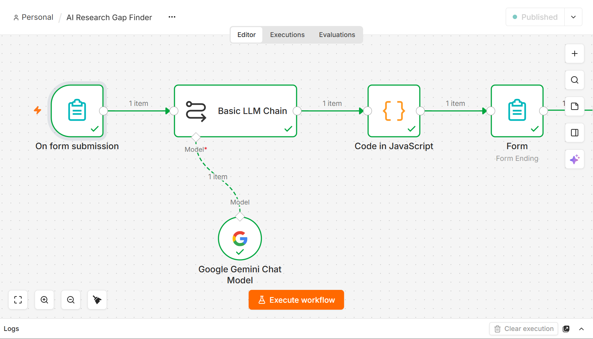
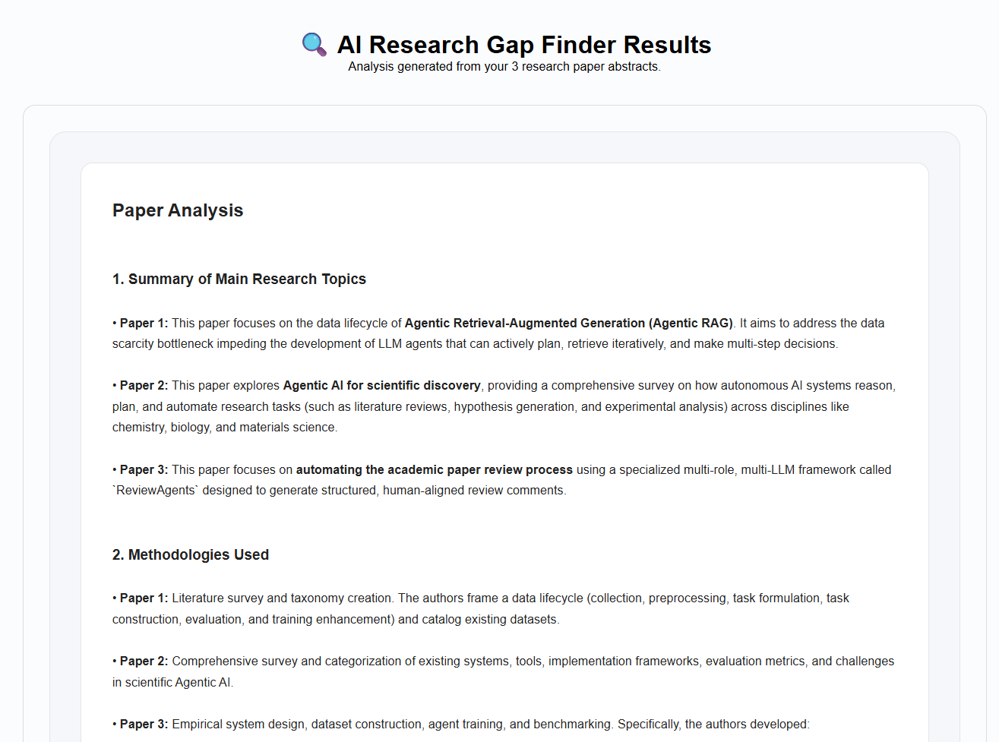

# 🔍 AI Research Gap Finder

> An AI-powered research assistant that analyzes three research paper abstracts, identifies research gaps, suggests research directions, and generates new research titles.

## 🚀 Live Demo

Try the AI Research Gap Finder:

**[Launch AI Research Gap Finder](https://sabakhalil03455.app.n8n.cloud/form/83821034-fae5-4eda-ad3c-50ec0e3bb5f5)**

---

## 📌 Overview

The **AI Research Gap Finder** is an automation workflow built with **n8n** and **Google Gemini**.

The application allows researchers and students to submit three research paper abstracts. The AI analyzes the papers together and identifies common limitations, missing areas, research gaps, and possible future research directions.

It also generates **5 potential research titles** and provides a recommended research title based on the identified gaps.

---

## ✨ Features

* 📄 Accepts 3 research paper abstracts
* 🔍 Identifies the main research topic of each paper
* 🧠 Analyzes the methodology used in each paper
* 📚 Identifies datasets and study context when mentioned
* 🔄 Compares the three papers
* ⚠️ Identifies limitations and missing areas
* 🔎 Detects important research gaps
* 💡 Suggests future research directions
* 📝 Generates exactly 5 new research titles
* 🏆 Provides a recommended research title
* 🎨 Displays results in a clean HTML interface

---

## 🔄 Workflow

The project follows this automation pipeline:

📝 **Research Paper Abstracts**

            ↓

🤖 **Google Gemini**

            ↓

🔍 **AI Analysis**

            ↓

📊 **Research Gaps**

            ↓

💡 **Research Directions**

            ↓

📝 **5 Research Titles**

            ↓

🏆 **Recommended Title**

            ↓

🌐 **Results Page**

---

## 🛠️ Technologies Used

| Technology           | Purpose                           |
| -------------------- | --------------------------------- |
| **n8n**              | Workflow automation               |
| **Google Gemini**    | AI-powered research analysis      |
| **JavaScript**       | AI response formatting            |
| **n8n Form Trigger** | Collecting research abstracts     |
| **Basic LLM Chain**  | Processing the research analysis  |
| **HTML/CSS**         | Formatting the final results page |

---

## 🧩 Workflow Architecture

The n8n workflow contains the following main components:

### 1. 📝 On Form Submission

Collects three research paper abstracts from the user.

### 2. 🤖 Basic LLM Chain

Sends the three abstracts to Google Gemini and performs the research analysis.

The AI:

* Summarizes each paper
* Identifies methodologies
* Compares the papers
* Identifies limitations
* Finds research gaps
* Suggests research directions
* Generates five research titles
* Provides a recommended title

### 3. 🧠 Google Gemini Chat Model

Provides the AI language model used to analyze the research abstracts.

### 4. 💻 Code in JavaScript

Processes the AI-generated response and converts the Markdown-style output into formatted HTML.

### 5. 🌐 Form

Displays the final research analysis through a clean web interface.

---

## 📸 Workflow Canvas



---

## 🖥️ Results Page



---

## 📋 Example Output

The application generates a structured research analysis.

### 📚 Paper Analysis

The system provides:

* Main research topic
* Methodology
* Dataset or study context
* Similarities between the papers
* Differences between the papers
* Limitations and missing areas

### 🔍 Research Gaps

The AI identifies important areas where existing research could potentially be extended or improved.

### 💡 Research Directions

The system suggests possible approaches for addressing the identified research gaps.

### 📝 5 New Research Titles

The application generates five research titles based on the identified research gaps.

### 🏆 Recommended Title

The AI provides a recommended research title along with an explanation of why it was selected based on the identified research gaps.

---

## 🎯 Use Cases

This project can be useful for:

* 🎓 University students
* 🔬 Researchers
* 📚 Literature review preparation
* 📝 Thesis topic exploration
* 💡 Research topic generation
* 🧠 Academic brainstorming
* 📖 Research gap identification
* 🚀 Early-stage research planning

---

## ⚙️ How to Use

### Step 1 — Open the Application

Open the **[AI Research Gap Finder](https://sabakhalil03455.app.n8n.cloud/form/83821034-fae5-4eda-ad3c-50ec0e3bb5f5)**.

### Step 2 — Enter Paper 1

Paste the abstract of your first research paper.

### Step 3 — Enter Paper 2

Paste the abstract of your second research paper.

### Step 4 — Enter Paper 3

Paste the abstract of your third research paper.

### Step 5 — Submit

Submit the form and wait for the AI analysis.

### Step 6 — Review the Results

The system will provide:

1. Paper analysis
2. Research gaps
3. Research directions
4. Five new research titles
5. A recommended research title
6. Reason for the recommendation

---

## 🔐 Security

This project uses external AI services through n8n credentials.

> ⚠️ **Important:** Never commit API keys, passwords, access tokens, or other sensitive credentials to GitHub.

Before publishing the workflow publicly, review the exported n8n JSON file and make sure no sensitive credentials or secrets are included.

---

## 📁 Project Structure

```text
ai-research-gap-finder/
│
├── README.md
├── ai-research-gap-finder.json
│
└── screenshots/
    ├── workflow-canvas.png
    └── results-page.png
```

---

## 🚀 Future Improvements

Possible future improvements include:

* 📄 Support for more than three research papers
* 📑 PDF research paper upload
* 🤖 Automatic PDF text extraction
* 🔗 Research paper URL input
* 📚 Citation extraction
* 🔄 Similarity analysis between papers
* 🧠 More advanced research-gap classification
* 📊 Research gap visualization
* 📥 Export results to PDF
* 📝 Export results to Word
* 💾 Save previous analyses
* 🔎 Integration with academic databases
* 🌐 Support for additional AI models

---

## 📈 Project Workflow Summary

```text
                  AI RESEARCH GAP FINDER
                           │
                           ▼
                ┌─────────────────────┐
                │ 3 Research Abstracts│
                └──────────┬──────────┘
                           │
                           ▼
                ┌─────────────────────┐
                │   Google Gemini     │
                │    AI Analysis      │
                └──────────┬──────────┘
                           │
                           ▼
                ┌─────────────────────┐
                │   Paper Analysis    │
                └──────────┬──────────┘
                           │
                           ▼
                ┌─────────────────────┐
                │   Research Gaps     │
                └──────────┬──────────┘
                           │
                           ▼
                ┌─────────────────────┐
                │ Research Directions │
                └──────────┬──────────┘
                           │
                           ▼
                ┌─────────────────────┐
                │ 5 Research Titles   │
                └──────────┬──────────┘
                           │
                           ▼
                ┌─────────────────────┐
                │ Recommended Title   │
                └──────────┬──────────┘
                           │
                           ▼
                ┌─────────────────────┐
                │   Results Web Page  │
                └─────────────────────┘
```

---

## 📄 License

This project is provided for **educational and research purposes**.

---

## 👨‍💻 Project

### AI Research Gap Finder

Built with:

* ⚙️ n8n
* 🤖 Google Gemini
* 💻 JavaScript
* 🌐 HTML/CSS

---

⭐ If you find this project useful, consider giving the repository a **star** on GitHub.
